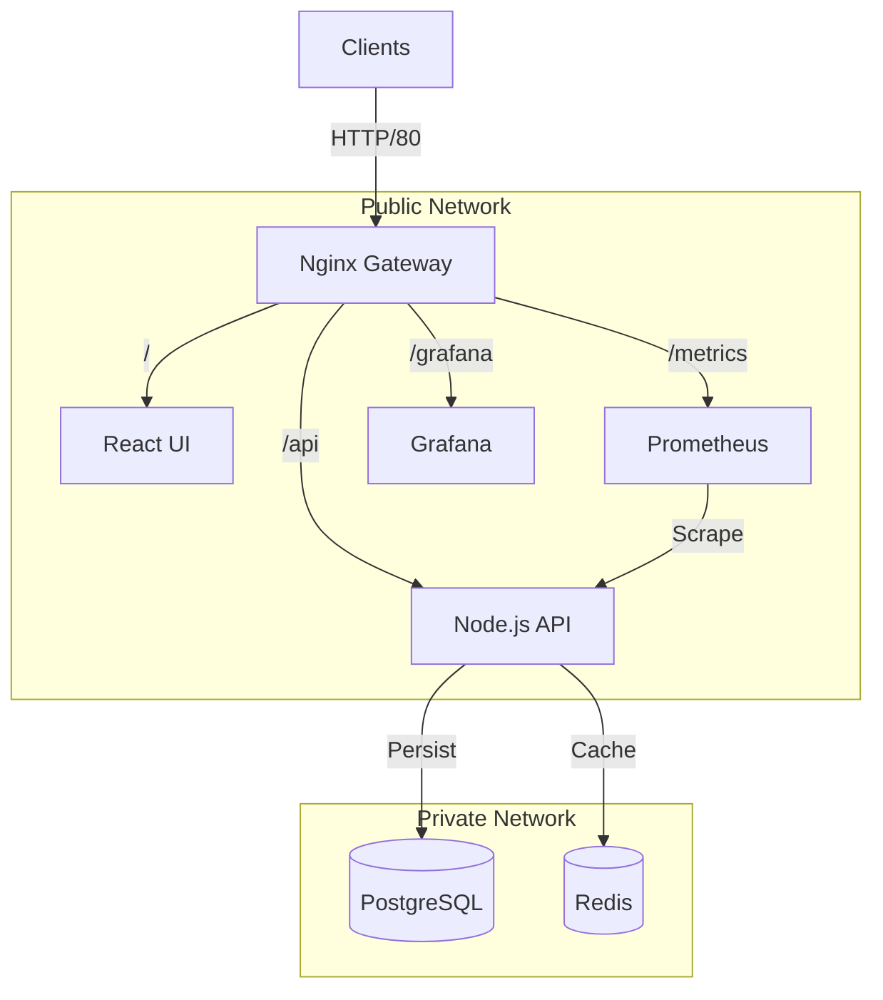

# OpsView: Microservices Analytics Dashboard

**A Production-Ready Microservices Architecture Demonstration**

OpsView is a full-stack analytics dashboard designed to demonstrate robust **Docker** orchestration, networking, and optimization patterns. It simulates a high-throughput event processing system with a real-time dashboard.

## 🚀 Features

-   **Microservices Architecture**: Decoupled services for Backend (API), Frontend (UI), Database, Cache, and Proxy.
-   **Docker Orchestration**: Complex dependency management and networking via `docker-compose`.
-   **Optimized Builds**: Multi-stage Dockerfiles reducing image sizes (Alpine Linux).
-   **High Availability & Health Checks**: Self-healing services with strict `HEALTHCHECK` policies.
-   **Security**: Isolated networks (`public-net`, `private-net`) preventing direct database access from the host.
-   **Monitoring**: Integrated **Prometheus** & **Grafana** stack for measuring system performance.
-   **Performance**: **Redis** caching strategy to reduce database load.

## 🛠 Tech Stack

-   **Frontend**: React, Vite, TypeScript, Recharts, Nginx (Serving static assets)
-   **Backend**: Node.js, Express, TypeScript, Prometheus Client
-   **Data**: PostgreSQL 15, Redis 7 (Alpine)
-   **Infrastructure**: Nginx (Reverse Proxy), Docker Compose

## 🏗 Architecture



## 🏁 Getting Started

### Prerequisites
-   Docker Desktop
-   Git

### Installation & Running

1.  **Clone the repository**
    ```bash
    git clone <repo-url>
    cd opsview
    ```

2.  **Start the application**
    ```bash
    docker-compose up --build -d
    ```

3.  **Access the Dashboard**
    -   **Frontend**: [http://localhost](http://localhost)
    -   **Backend API**: [http://localhost/api/health](http://localhost/api/health)
    -   **Grafana**: [http://localhost:3000](http://localhost:3000) (Login: admin/admin)
    -   **Prometheus**: [http://localhost:9090](http://localhost:9090)

## 🔍 Key Implementation Details

1.  **Multi-Stage Docker Builds**:
    The generic `node` image is huge (~1GB). We use multi-stage builds to compile TypeScript and then copy *only* the necessary artifacts to a lean `alpine` runtime image, reducing the final footprint significantly.

2.  **Network Isolation**:
    The `postgres` and `redis` services are attached *only* to the `private-net`. They are **not** exposed to the host machine or the public internet. Only the `backend` service can communicate with them.

3.  **Health Checks**:
    `docker-compose` is configured with `healthcheck` commands. The `backend` will not start until `postgres` and `redis` report they are healthy, solving race conditions during startup.

4.  **Reverse Proxy**:
    Nginx acts as the single entry point (API Gateway), routing traffic to the Frontend container for static assets and the Backend container for API requests, resolving CORS issues naturally.

---
*Built for Portfolio Demonstration*
