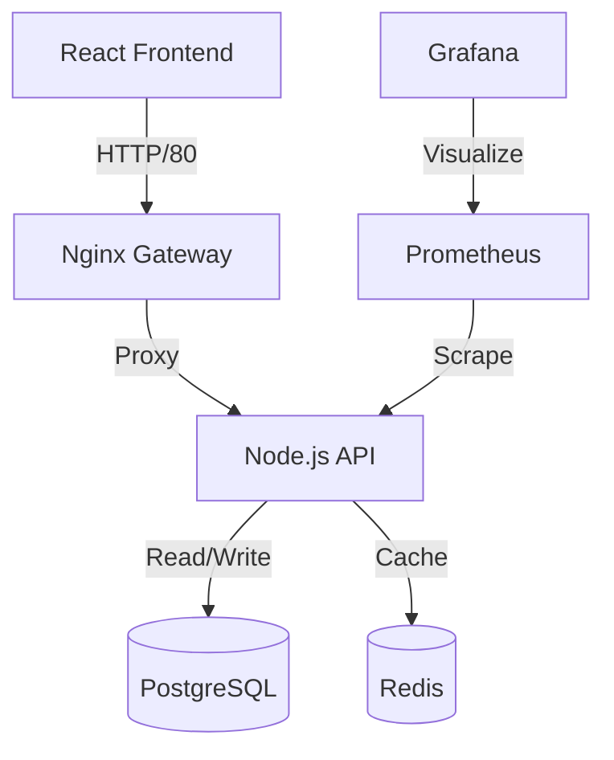

# OpsView: Microservices System Monitor 🚀


**OpsView** is a production-ready microservices application designed to demonstrate advanced containerization patterns. It simulates a high-throughput event processing system with a real-time dashboard.

> **Why this project?**
> This repository serves as a practical implementation of a modern DevOps workflow, showcasing how to build, network, persist, and automate a distributed system using Docker.

---

## 🏗️ Architecture

The system is composed of **5 decoupled microservices**:



| Service | Tech Stack | Role |
| :--- | :--- | :--- |
| **Frontend** | React + Vite + Nginx | Real-time dashboard for system metrics. |
| **Backend** | Node.js + Express | REST API handling event ingestion and statistics. |
| **Database** | PostgreSQL | Persistent storage for event logs. |
| **Cache** | Redis | High-speed caching for API responses. |
| **Monitoring** | Prometheus + Grafana | Infrastructure observability (CPU, Memory, Request Latency). |

---

## 🐳 Docker Patterns Demonstrated

This project goes beyond `docker build .`. It implements:

### 1. **Optimized Images (Multi-Stage Builds)**
- **Frontend**: Compiles TypeScript to static HTML/CSS/JS in a `builder` stage, then copies *only* the artifacts to a lightweight `nginx:alpine` image.
    - Result: **95% smaller image** (20MB vs 1GB).
- **Backend**: Uses `npm ci --only=production` to exclude devDependencies in the final image.

### 2. **Security & Networking**
- **Network Isolation**:
    - `public-net`: Accessible to the outside world (Frontend, Gateway).
    - `private-net`: Strictly internal (Database, Redis).
    - The Database is **completely inaccessible** from the public internet, accessible only by the API.

### 3. **Data Persistence**
- **Named Volumes**: Used for Database and Prometheus data (`postgres_data`) to survive container restarts.
- **Bind Mounts**: Used in *Development Mode* to mirror source code into the container for hot-reloading.

### 4. **Infrastructure as Code (IaC)**
- **Docker Compose**: Orchestrates the entire stack, handling dependency kickoff order (`depends_on`) and health checks.
- **Health Checks**: Containers report their status (`pg_isready`, `curl localhost/health`), and dependent services wait until they are actually ready to accept connections.

### 5. **CI/CD Automation**
- **GitHub Actions**: Automated pipeline triggers on every push.
    - Builds all Docker images to ensure Dockerfile validity.
    - Spins up the entire stack in the CI environment.
    - Runs integration tests (`curl` health checks) to verify service-to-service communication.

---

## 🚀 Getting Started

### Prerequisites
- Docker & Docker Compose

### Run in Production Mode
```bash
docker compose up -d --build
```
Access the dashboard at `http://localhost`.

### Run in Development Mode (Hot Reload)
```bash
# Uses docker-compose.dev.yml to mount source code
docker compose -f docker-compose.yml -f docker-compose.dev.yml up -d
```
- **Frontend**: http://localhost:5173 (Edits to `src/App.tsx` reflect instantly)
- **Backend**: http://localhost:3000 (Edits to `src/index.ts` restart server)

---

## 🧪 Simulation
Generate traffic to see the dashboard light up:
```bash
# Ingest a test event
curl -X POST http://localhost:3000/api/events \
  -H "Content-Type: application/json" \
  -d '{"type": "user_signup", "payload": {"id": 123}}'
```
